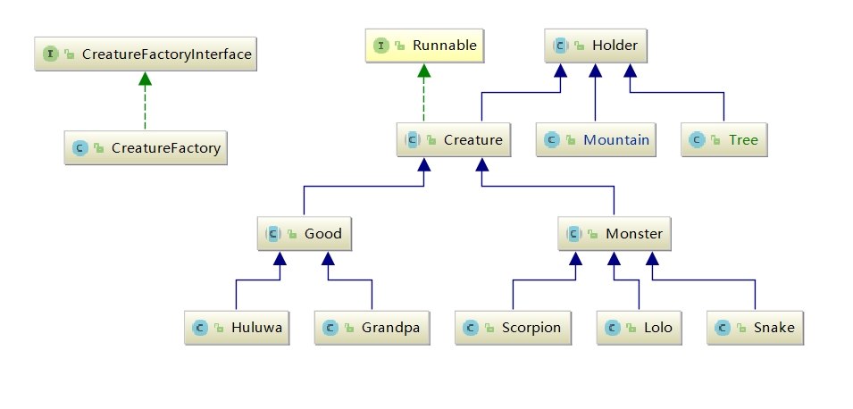

# Huluwa

151220131

谢旻晖

*xiemhemail@gmai.com*

## 游戏界面


## 操作指南

### 设置配置文件

在`resources/configure.properties`文件中有对战场设置、葫芦娃爷爷妖怪们属性的设置。改变值即可改变对应属性，在程序load这个配置文件时会自动对合法性进行检查。

```properties
# 战场布置相关
# 战场宽/格  合法范围10~30
NRX=10
# 战场长/格  合法范围10~30
NRY=10
# 初始小妖怪喽喽数目 合法范围0~10
NR_LOLOS=5
# 相遇的距离，当两者间的X轴距离和Y轴距离小于这个常量时，进行交战
# 合法范围0~2
DISTANCE_OF_ENCOUNTER=1

# 战斗属性设置
# 攻击力合法范围0~100
# HP合法范围1~100 （100为满血）

# 葫芦兄弟攻击力
DMG_OF_HULUWA=20
# 葫芦兄弟血量
HP_OF_HULUWA=100
# 爷爷攻击力
DMG_OF_GRANDPA=1
# 爷爷血量
HP_OF_GRANDPA=50

# 蛇精攻击力
DMG_OF_SNAKE=100
# 蛇精血量
HP_OF_SNAKE=100
# 蝎子精攻击力
DMG_OF_SCORPION=10
# 蛇精血量
HP_OF_SCORPION=100
# 小喽喽攻击力
DMG_OF_LOLO=30
# 小喽喽血量
HP_OF_LOLO=20
```

### 键盘操作


### 游戏流程

## 代码结构

### 包结构

```
└─main
    ├─java
    │  └─cn
    │      └─xmh	#所有代码文件均在cn.xmh包下（避免冲突）
    │          ├─battleGround #战场相关类
    │          ├─formations   #阵法布置
    │          ├─holders      #可以用来占一个格子的东西，可以是地形
    │		  │	 │			#可以是人，可以是妖怪
    │          │  └─creatures #生物，也是一种holder
    │          │      ├─bad   #妖怪
    │          │      └─good  #好人
    │          ├─position	  #抽象的位置定义和实际的二维位置实现
    │          ├─recorder     #回放功能相关
    │          ├─settings     #读取配置文件
    │          └─view         #ui相关
    └─resources
```

### 类结构

最基本的思想是视图，模型，控制三者分离，这样当我们升级其中的某一种时，比如从一个很平庸的swing显示窗口更换为其他高大上的显示，或是这次从全自动的电脑对电脑打架换成人机对战，改动的代码尽量少。

- 模型
  - 所有生物
- 视图
  - swing相关的类，均在`cn.xmh.view`下
- 控制
  - BattleGround类，与视图、模型直接交互，读取用户的输入，更新所有模型的数据，通知视图更新、重绘。

具体的，分以下几个重要部分进行阐述。

#### settings相关

package settings的主要职责是读取配置文件，加载各种各样的图。其中`class Settings`用于读取配置文件，`interface ImagesSet`用于加载各种各样的图。这样每个生物所要用到的图都可以从这个接口中获得。

```java
public interface ImagesSet {
    ......
    final Image[] HuluwaImage=new Image[]{
        new ImageIcon(ImagesSet.class.getClassLoader().getResource("1.png")).getImage(),
        new ImageIcon(ImagesSet.class.getClassLoader().getResource("2.png")).getImage(),
        new ImageIcon(ImagesSet.class.getClassLoader().getResource("3.png")).getImage(),
        new ImageIcon(ImagesSet.class.getClassLoader().getResource("4.png")).getImage(),
        new ImageIcon(ImagesSet.class.getClassLoader().getResource("5.png")).getImage(),
        new ImageIcon(ImagesSet.class.getClassLoader().getResource("6.png")).getImage(),
        new ImageIcon(ImagesSet.class.getClassLoader().getResource("7.png")).getImage()
    };
   ......

}
```

#### Holder相关



我定义出了一种可以占一个位置的`Holder`类，他有自己的一张代表图，有占的位置(**此处的位置均为抽象的接口，以便更换实现时改动尽量少的代码**)。

```java
abstract public class Holder{
    protected Image image;
    protected PositionInterface position;
}
```

定义出`Holder`的子类`Creature`生物和`Mountain`山.

`Creature`生物有一些生物通用的属性和方法，比如攻击力，生命值，改变自己的位置(**仍然是抽象意义上的位置**)，死掉，最关键的是每个生物都是一个线程，所以`Creature`有一个抽象方法`abstract void run()`。

```java
abstract public class Creature extends Holder implements Runnable {
	protected int hp = 0;
	protected int damage = 0;
	public void setPosition(PositionInterface position)
     public void Die()
    abstract void run();
}
```

然后，继而定义出抽象类好人类`Good`，和抽象妖怪类`Monster`,葫芦娃、爷爷、蛇精等等再分别继承自他们。

#### 泛型生物工厂接口


为了生成生物，我使用泛型抽象出一个生物工厂接口`interface CreatureFactoryInterface`，再给出一个具体的实现`CreatureFactory`,用于生成本例中的所有生物。

其中抽象工厂接口的形式如下，他具有一个泛型方法接受一个`Creature`的子类的class反射对象，以及生物初始位置(**也是抽象的**)。

```java
public interface CreatureFactoryInterface {
     <T extends Creature> T createCreature(Class<T> tClass, PositionInterface positionInterface);
}
```

#### 位置相关类


**我所有的位置均是在抽象意义的位置上进行操作、改变的**，因此当我想从二维平面葫芦娃改变成三维立体葫芦娃或是一维直线对战形葫芦娃，是非常方便的。

我定义了所有位置的接口`interface PositionInterface`,他具有一些广义位置上的特性，比如在这个位置上放一个`holder`,得到坐标,判断另外一个坐标是不是在自己旁边，判断相对位置。

```java
public interface PositionInterface {
    Holder getHolder();
    void setHolder(Holder holder);
    int[] getValue();
    String toString();
    boolean isNear(PositionInterface other);
    int  relativePositionofThis(PositionInterface a);
}
```

同时给出一个二维意义下的实现`class TwoDimePosition`,和二维坐标集合`TwoDimePositionSet`,这个集合中存放了$$N*M$$个位置，并通过`class Settings`读取配置文件来获得$N$和$M$的值进行初始化。

#### 战场相关类


一个战场有哪些要素，无非两者，生物和位置。此外还有一些方便程序编写的方法，比如碰撞检测、得到某个位置上的`Holder`之类的、添加生物、删除生物。

```java
abstract public class BattleGround {
......
  protected static List<PositionInterface> positionInterfaces = TwoDimePositionSet.getPositionInterfaces();
  static protected List<Creature> creatures = Collections.synchronizedList(new ArrayList<Creature>());
  ......
  public abstract void collisionDetection();
  public void addCreatures(Creature... creatures);
  public boolean deleteCreature(Creature target);
}
```

这个类会在实际运行中被多线程同时访问，因为每个生物都要获得战场的状态来判断自己下一步的行动怎么办。为此我将关键的生物和位置队列使用了`Collections.synchronizedList`来保证**线程安全**。

同时我又实现了二维意义下的战场`class TwoDimeBattleGround`，他实现了其中的碰撞检测。

#### Recorder相关

这个是回放相关的，由于多线程的异步性，在实现回放时我的第一个想法就是像录屏软件一样把战斗从开始到结束录制下来。这样就可以完成回放。

我使用了`java.awt.Robot`类来获得指定区域的屏幕截图，每隔40ms截一次，依次保存到指定目录下。`class Recorder`本身也是一个`Thread`.

回放时也只要将这些图以相同的速率一张张的播放即可。

#### 阵法相关


```java
public interface FormationChanger {
    void changFormation(PositionInterface startPos, List<?extends Creature> toBeArrangeCreatures);
}
```

我抽象出阵法的接口，他接受一个阵法布置的起始点，接受一堆要摆放的生物。然后对他们的位置进行arrange.

各种阵形均继承于他。

#### Ui相关

swing相关的设计的比较简单就不提了，有一个定时器会每隔100ms驱动界面进行刷新，刷新时UI从战场类中获得所有现存生物的位置，进行绘制。

在swing事件处理时，定义内部类`private class`，通过`父类类名.this`获得父类对象，同时，内部类对外围对象的函数均可调用，但其他类对内部类则无法访问，体现了封装的思想。

#### 总类图


## 设计思想

本程序运用到许多课上所讲的东西，实践证明，确实老师们所讲的是可以帮助我的编码的。具体的来看，包括这样几点：

1. 多用`assert`断言，让错误无从遁形

2. 在swing事件处理时，内部类继承默认Adapter,使用了默认适配器模式，仅重写自己需要的部分。大大简便了代码的编写。

   ```java
   private class TAdapter extends KeyAdapter {
     ......
     @Override
     public void keyPressed(KeyEvent e) {
       int key = e.getKeyCode();
       if (key == KeyEvent.VK_SPACE) {
         spaceHandle();
       }
     }
   }
   ```

   ​


## 尾声

