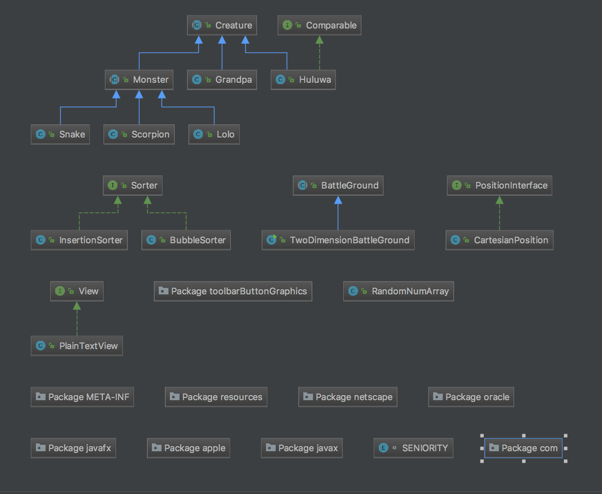

# 葫芦娃V2.0（二维对峙葫芦娃）

###151220131 谢旻晖

## 类图




## 类及意义

战场相关的类

|       类型       |           Name           |      意义      |
| :------------: | :----------------------: | :----------: |
| Abstract Class |       BattleGround       |   抽象意义上的战场   |
|     Class      | TwoDimensionBattleGround |  二维平面战场具体实现  |
|   Interface    |    PositionInterface     |    广义坐标接口    |
|     Class      |    CartesianPosition     | 任意维笛卡尔坐标具体实现 |

生物相关的类

|       类型       |   Name   |  意义   |
| :------------: | :------: | :---: |
| Abstract Class | Creature | 抽象生物  |
| Abstract Class | Monster  | 抽象妖怪  |
|     Class      |  Huluwa  |  葫芦娃  |
|     Class      | Grandpa  |  爷爷   |
|     Class      |   Lolo   | 小喽喽妖怪 |
|     Class      |  Snake   |  蛇精   |
|     Class      | Scorpion |  蝎子精  |

视相关

|    类型     |     Name      |   意义   |
| :-------: | :-----------: | :----: |
| Interface |     View      | 抽象广义视  |
|   Class   | PlainTextView | 控制台输出视 |

杂项

|    类型     |      Name      |     意义     |
| :-------: | :------------: | :--------: |
|   Class   | RandomNumArray | 不重复的随机数产生器 |
| Interface |     Sorter     |     排序     |


## 设计思想

基于老师给出的example作出修改（前一次的作业写的实在太差，和老师的没法比）

1. 所有角色将其抽象成抽象类**Creature**，声明共用方法，同时实现比较接口**Comparable**,以便可以对任何生物体进行排序,各种生物均继承于此。

2. Creature中预留act抽象方法，现在葫芦娃啥都不会，爷爷和蛇精也只会喊666，说不定之后的哪次作业他们就开始动起来了。

   ```java

   abstract public class Creature {
   	......
       abstract public void act();
   }

   ```

   ​

3. 抽象出**PositionInterface**,定义出了更广义上的坐标.

   ```java
   public interface PositionInterface {
       Creature getHolder();
       void setHolder(Creature holder);
       int[] getPosition();
       void setPosition(int ...pos);
       String toString();
   }
   ```

   给出具体的**笛卡尔坐标**实现，利用**可变参数**，一个类实现所有维度的笛卡尔坐标

   ```java
   public class CartesianPosition implements PositionInterface{

       private int[] coords;//i.e.  (x,y) or (x,y,z) or (x1,x2,x3...)
       private Creature holder;
       public CartesianPosition(int ...pos) 
       ......
   ```

   ​

4. 抽象出**BattleGround**,定义出广义上的战场,他有一系列抽象的坐标，有一群生物，会往战场中加入生物，会清除生物，可以查看具体坐标的生物是什么，可以有观察整个战场情况的`show()`,以及最重要的打架`battle()`.

   ```java
   //下面的代码删去了具体实现（为了缩减readme的容量）
   abstract public class BattleGround {
       protected PositionInterface[] positionInterfaces;
       protected List<Creature> creatures;

       public PositionInterface[] getPositionInterfaces()
       public List<Creature> getCreatures() 
       public void addCreatures(Creature ... creatures)
       public boolean deleteCreature(Creature target)
       public Creature getCreatureInPosition (PositionInterface pos)

       //view the battleground
       abstract void show();

       public abstract void initCreature();

       //the battle processing
       abstract void battle();
   }
   ```

给出二维下的实现**TwoDimensionBattleGround**,并简单的实现了几种阵形。

 5.  将所有的阵形抽象为原型如下的函数

     ```java
     public void 某阵形(PositionInterface startPos,Creature ... toBeArrangeCreatures)  
     ```

     其中startPos为起始点，toBeArrangeCreatures为待排兵布阵的生物。

 6.  所有的输出均会由接口View的实现来承担，我实现了**PlainTextView**，即文本输出类

 7.  运用到的设计模式主要为单例模式、工厂模式。其中**GrandPa**.**Snake**等奇怪的生物，**PlainTextView**视图类，**BattleGround**战场类均为单例。

## 面向对象的好处

- 设计过程自然，便于重构，这点我深有体会，改老师的代码改到二维着实方便，改我第二次作业的代码稍微改了一下就放弃了。
- 访问控制减少了过多暴露的数据，减少了BUG的发生的几率。
- 利用向上转型，实现多态，具有灵活性和可扩充性。

## 心得

我以前写的是假面向对象,我要好好学面向对象。

## 最终输出

```
随机站
-----------------------------
                        
    三                  
        七              
              五        
                  二    
                        
                四      
                        
          大            
                        
  六                    
                        
-----------------------------
排序
-----------------------------
                        
                        
    大                  
    二                  
    三                  
    四                  
    五                  
    六                  
    七                  
                        
                        
                        
-----------------------------
雁行阵
-----------------------------
                        
                      喽
    大              喽  
    二            喽    
    三          喽      
    四        喽        
    五    蝎喽          
    六    喽            
    七                  
                        
                        
                        
-----------------------------
爷爷加入战场：我来了，葫芦娃们，我们上！
蛇精加入战场：如意如意,随我心意！
-----------------------------
                        
                      喽
    大              喽  
    二            喽    
    三          喽      
爷  四    蛇  喽        
    五    蝎喽          
    六    喽            
    七                  
                        
                        
                        
-----------------------------
小怪们变换阵形_鹤翼阵
-----------------------------
                        
                        
    大                  
    二                喽
    三              喽  
爷  四    蛇      喽    
    五    蝎    喽      
    六            喽    
    七              喽  
                      喽
                        
                        
-----------------------------
小怪们变换阵形_衡呃阵
-----------------------------
                        
                        
    大                  
    二      喽          
    三        喽        
爷  四    蛇喽          
    五    蝎  喽        
    六      喽          
    七        喽        
            喽          
                        
                        
-----------------------------
小怪们变换阵形_锋矢阵
-----------------------------
                        
                        
    大                  
    二                  
    三    喽            
爷  四  喽喽喽喽喽      
    五    喽            
    六                  
    七                  
                        
                        
                        
-----------------------------
```

